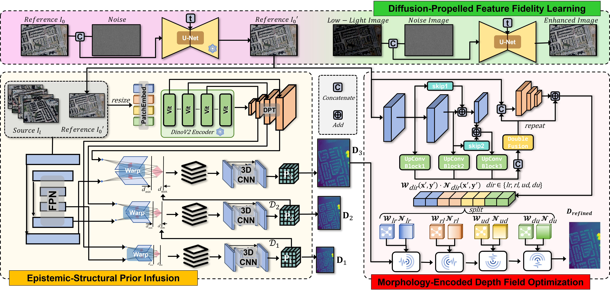
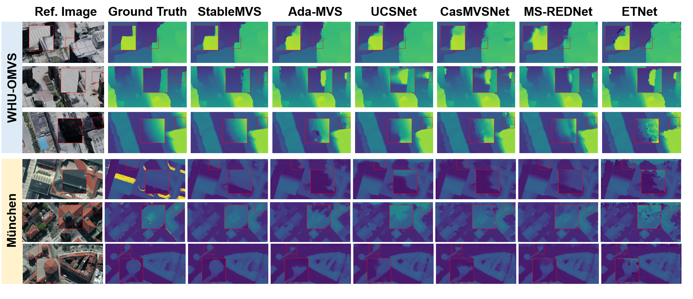

# StableMVS: Diffusion-Propelled Stable Multi-View Stereo via Epistemic and Morphological Priors for Urban Depth Ambiguity


**[Anonymous Project Page](https://anonymous.4open.science/r/StableMVS)**  

---

## Abstract  

This repository contains the official implementation of **StableMVS**, a robust multi-view stereo framework tailored for urban environments, introducing epistemic priors, morphology-guided propagation, and diffusion-based depth refinement to address low-texture, occlusion, and geometric ambiguity.

---

## Highlights

- **Epistemic Priors**: Integrates knowledge from large vision models into cost volume construction.
- **Morphological Optimization**: Uses structural contours to improve depth smoothness and edge preservation.
- **Diffusion-Driven Learning**: Enhances illumination-invariant feature learning via perturbation recovery.

---

## Overview



---
## Qualitative result



---
## Installation

```bash
git clone https://anonymous.4open.science/r/StableMVS.git
cd StableMVS
conda create -n stablemvs python=3.10
conda activate stablemvs
pip install -r requirements.txt
```

---

## Dataset Preparation

Supported datasets:

- [ ] [WHU-OMVS](https://gpcv.whu.edu.cn/data/WHU_OMVS_dataset/WHU_dataset.htm)
- [ ] [München](https://phowo.ifp.uni-stuttgart.de/publications/phowo13/240Haala-new.pdf)
- [ ] [BlendedMVS ](https://github.com/YoYo000/BlendedMVS)

---

## Inference and Evaluation WHU-OMVS

```bash
python test.py 
```

---

## Training WHU-OMVS

```bash
python try.py
```

## 

## Pretrained Models


## Results
### WHU-O MVS Benchmark Results

| **Method**     | **MAE (m)** | **rMAE (%)** | **RMSE (m)** | **EAcc (m)** | **T1 (%)** | **T3 (%)** | **T6 (%)** | **T10 (%)** |
|----------------|-------------|--------------|--------------|--------------|------------|------------|------------|-------------|
| CasMVSNet      | 0.164       | 0.31         | 0.479        | 0.379        | 58.69      | 91.04      | 96.57      | 97.89       |
| AdaMVS         | 0.171       | 0.33         | _0.416_      | 0.362        | 52.50      | 89.07      | 96.61      | 98.25       |
| MS-REDNet      | 0.199       | 0.37         | 0.518        | 0.425        | 52.26      | 86.38      | 94.83      | 97.20       |
| UCSNet         | _0.149_     | _0.29_       | 0.440        | _0.335_      | _59.95_    | _92.59_    | _97.39_    | _98.37_     |
| ETNet          | 0.195       | 0.37         | 0.474        | 0.400        | 44.21      | 86.04      | 96.42      | 98.02       |
| AggrMVS        | 0.153       | --           | --           | --           | --         | --         | 97.00      | 97.96       |
| **StableMVS**  | **0.128**   | **0.25**     | **0.342**    | **0.273**    | **62.20**  | **94.00**  | **98.20**  | **98.97**   |


### BlendedMVS Benchmark Results

Comparison results of different methods on the BlendedMVS dataset. **StableMVS ranks first across all metrics.**

| **Method**       | **EPE** | **E1 (%)** | **E3 (%)** |
|------------------|---------|------------|------------|
| MVSNet           | 1.49    | 21.98      | 8.32       |
| CasMVSNet        | 1.43    | 19.01      | 9.77       |
| CVP-MVSNet       | 1.90    | 19.73      | 10.24      |
| Vis-MVSNet       | 1.47    | 15.14      | 5.13       |
| EPP-MVSNet       | 1.17    | 12.66      | 6.20       |
| UCS-MVSNet       | 1.32    | 14.12      | 7.33       |
| TransMVSNet      | 0.73    | 8.32       | 3.62       |
| NR-MVSNet        | 0.85    | 8.47       | 4.01       |
| UniMVSNet        | _0.62_  | 9.35       | 3.25       |
| ARAI-MVSNet      | 0.67    | _7.91_     | _2.95_     |
| **StableMVS**    | **0.55**| **7.66**   | **2.93**   |


More quantitative and qualitative results are available in the [paper](#).

---

## Citation

**Note:** This work is currently under double-blind peer review. Citation will be updated upon publication.

---

## Contact

For questions during the review process, please raise an issue in this repository or reach out through the anonymous communication channel provided in the supplementary.

---
